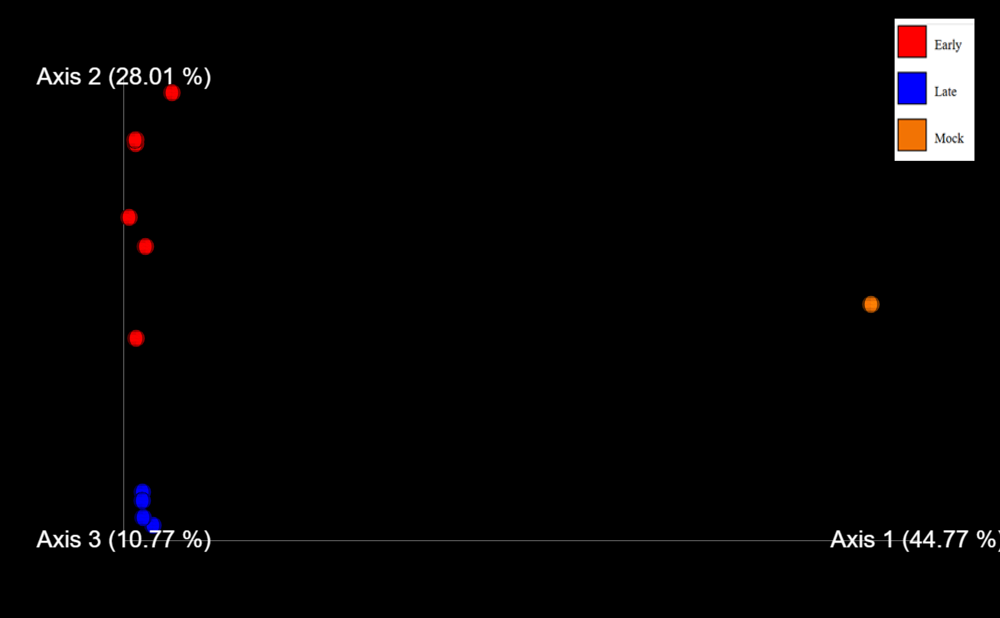
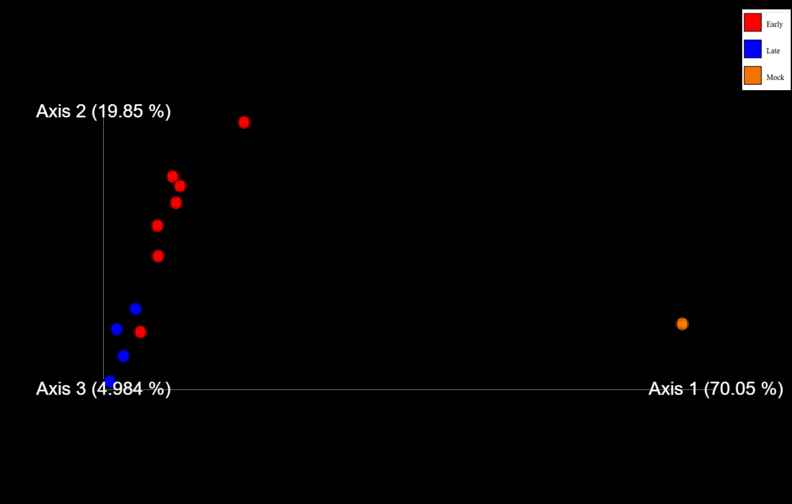
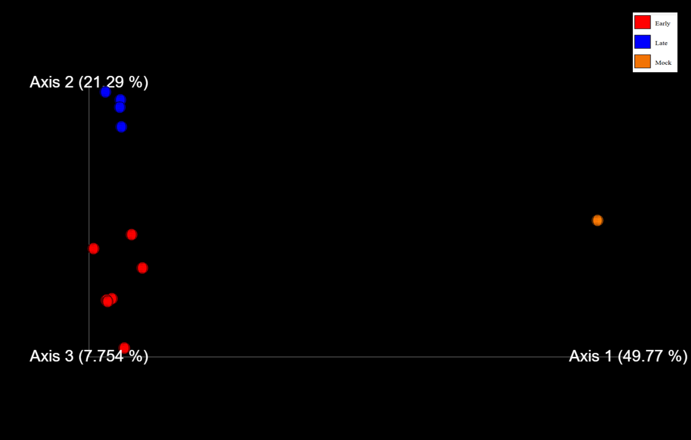
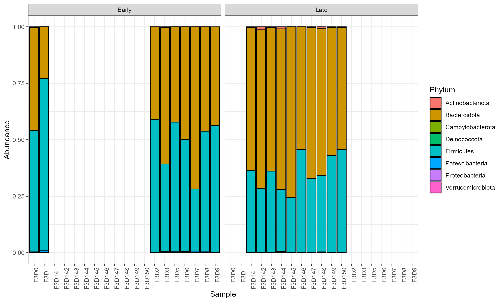
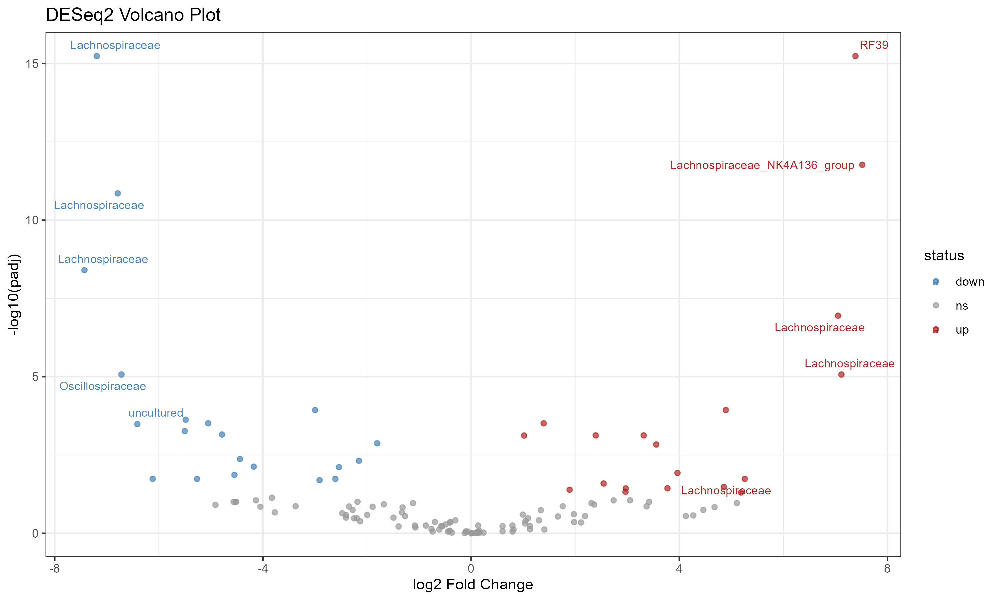
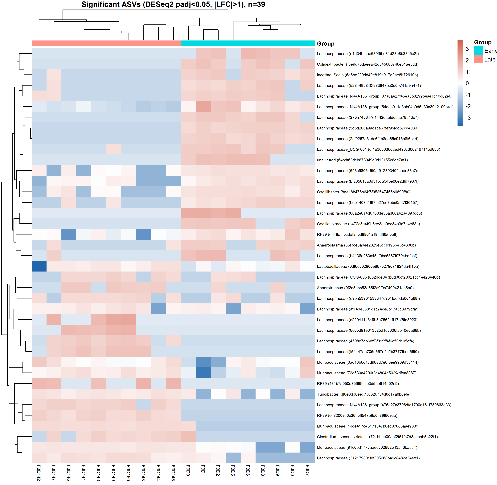

# **16S rRNA Microbial Community Analysis**

This repository contains comprehensive analysis of 16S rRNA sequencing data to investigate microbial community dynamics across different stages. The study focuses on comparing microbial composition and diversity across three groups:

* Early
* Late
* Mock (control)

The study integrates alpha diversity and beta diversity (PCoA) analyses using multiple distance metrics.


## **Repository Structure**

```bash
microbiome-analysis/
├── scripts/
├── results/
└── README.md

```

## Dataset

**Source:** MiSeq SOP Example Data 
<br>
**Download:** https://mothur.s3.us-east-2.amazonaws.com/wiki/miseqsopdata.zip
<br>
**Species:** Mouse


## **Methods**

* **Alpha Diversity Metrics**

** Observed Features (Richness)
<br>
** Shannon Diversity
<br>
** Faith’s Phylogenetic Diversity
<br>
** Pielou’s Evenness

* **Beta Diversity Metrics**
  
** Bray–Curtis (abundance-based)
<br>
** Weighted UniFrac (abundance + phylogeny)
<br>
** Unweighted UniFrac (presence/absence + phylogeny)

* **Tools Used**

** QIIME2
<br>
** DADA2
<br>
** R (phyloseq, ggplot2)


## **Results**

* **Alpha Diversity (Within- sample diversity)**

Alpha diversity was assessed using four complementary metrics. Statistical comparisons used the Kruskal-Wallis test with FDR correction.

|            Metric        |      H- value    |       p- value      |    Mean   |
| ------------------------ | ---------------- | --------------------|-----------|
| Shannon                  |      4.98        |      0.08           |    5.12   |
| Observed Features        |      2.92        |      0.23           |    83.2   |
| Faith’s PD               |      3.62        |      0.16           |    6.02   |
| Pielou’s Evenness        |      6.89        |      0.03           |    0.81   |

Microbial communities across mock, early, and late groups consist of roughly similar types and numbers of organisms, with no significant differences in richness or phylogenetic diversity. However, their distribution varies significantly, as reflected by changes in evenness, indicating that the transition from early to late stages is associated with shifts in relative abundance where some taxa become dominant while others decline, rather than the loss or gain of taxa.


* **Beta Diversity (Between- sample diversity)**

Community composition was compared using three distance metrics with PERMANOVA (999 permutations) to test group-level significance

|            Metric        |      pseudo-F    |       p- value       |
| ------------------------ | ---------------- | -------------------- |
| Bray-Curtis              |      10.06       |      0.001           |   
| Weighted UniFrac         |      20.44       |      0.002           |    
| Unweighted UniFrac       |      9.91        |      0.001           |    

Beta diversity analysis revealed clear and significant differences in overall community composition between groups across all distance metrics. Notably, weighted UniFrac showed the strongest separation, suggesting that changes are primarily driven by shifts in the abundance of phylogenetically related taxa.


        **Bray Curtis Emperor**


        **Weighted Unifrac Emperor**


        **Unweighted Unifrac Emperor**


### Bacterial Phyla Composition


        **Phyla composition**

Bacteroidota and Firmicutes dominate the community but vary in relative abundance between Early and Late samples. This suggests a temporal restructuring of the microbiome.In the phylum-level bar plot, only two or three phyla are clearly visible because they dominate the microbial community. The remaining phyla are present at very low abundances, making them nearly invisible in the plot.

### Volcano Plot


        **Volacano plot**

This volcano plot highlights the most significantly changed taxa between groups. The top 5 upregulated taxa (highest positive log2 fold change) and top 5 downregulated taxa (lowest negative log2 fold change) are labeled, providing a clear view of key microbial shifts.

### Significant Taxa


        **Heatmap**

This heatmap shows differences in microbial taxa across time points based on DESeq2 results (adjusted p < 0.05, |log2FC| > 1). Some taxa are more abundant in Early samples, while others are higher in Late samples, indicating a shift in community composition over time. This suggests a temporal change in the microbial community structure.


## Conclusion

The microbiome analysis indicates that while the richness and phylogenetic diversity of microbial communities remain largely stable over time, the relative abundances of taxa shift significantly between early and late stages. The transition from early to late stages is marked by reorganization of microbial populations rather than loss or gain of taxa.


## Author

**Bhavya Maggo**


